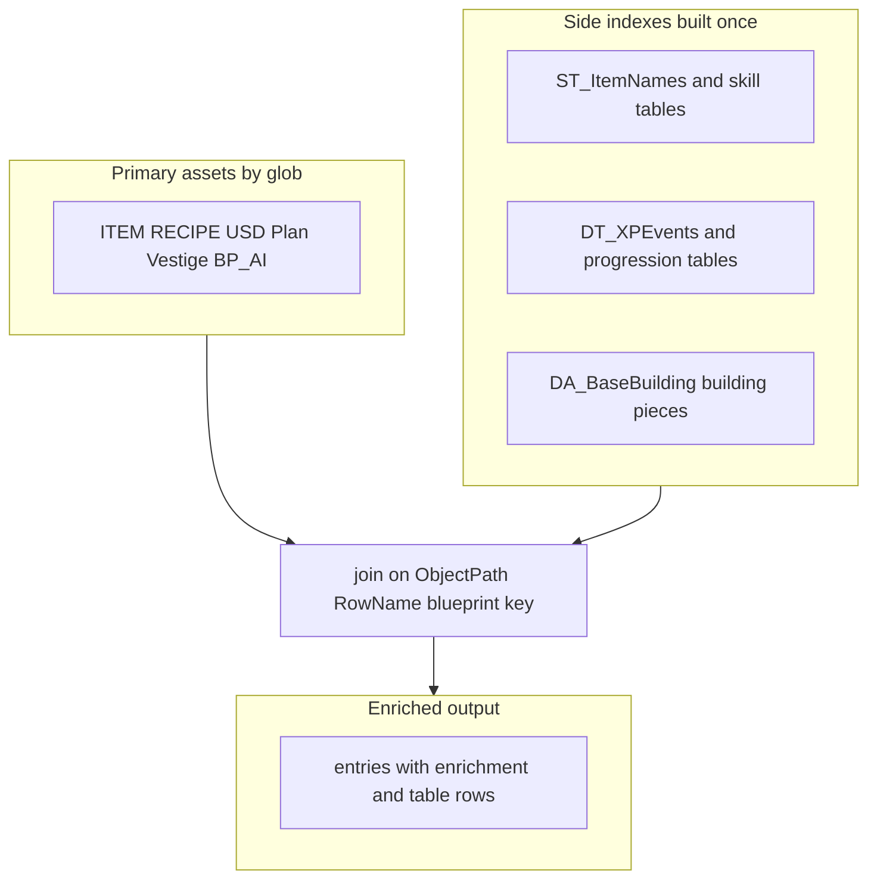

# Data enrichment for compile pipelines

This document describes how compile scripts evolve from **single-asset JSON dumps** toward **NPCData-style joins**: batch-built indexes, keyed resolution, and optional `issues[]` entries when lookups fail.

## Methodology (same idea as NPCData)

1. **Primary assets** — globs that define rows (e.g. `ITEM_*`, `RECIPE_*`, `USD_*`, `BP_AI_*_Character`).
2. **Side indexes** — other files loaded **once** into dicts keyed by blueprint name, `ObjectPath` package stem, `DataTable` + `RowName`, or string-table keys.
3. **Join / resolve** — for each primary row, read refs in `Properties` and attach resolved display strings, table rows, or neighbor assets. This is **not** a depth-first graph crawl; it is **batch index + keyed join**, which scales and stays debuggable.

**Repeatable analysis workflow**

1. Sample a few representative JSONs per category.
2. List reference shapes in `Properties`: `ObjectPath` + `ObjectName`, `DataTable` + `RowName`, localization `Key` / `TableId`, gameplay tags.
3. Classify each ref: resolvable to another `.json` export vs engine-only (texture, mesh) vs optional.
4. Choose side cars: `ST_ItemNames.json`, `SKILL_*.json`, `DT_XPEvents_*.json`, `DA_BaseBuilding_*`, etc.
5. Implement in phases: (A) denormalize names, (B) resolve `DataTable` rows, (C) reverse indexes only where worth the cost.

Shared helpers live in [`compiledata.py`](compiledata.py) (imported as a library by each `Compile*Data.py`). The same script’s `main()` runs the **full pipeline** via subprocess when you execute `python website/tools/compiledata.py`. Item **display names** are resolved from each item asset’s `Properties.Name` (and string-table `Key` when needed), keyed by **`ObjectPath` → `{jsonRoot}/{package}.json`** — the same idea as [`CompileLootData.py`](LootData/CompileLootData.py); `ST_ItemNames` keys are not `ITEM_*` ids, so lookups by id alone are not enough.

### Item display resolution and fallbacks

1. Prefer **`Name.LocalizedString` / `SourceString`**, then **`Name.Key`** looked up in **`ST_ItemNames`**.
2. If still unresolved, **`compiledata.item_display_fallback_from_properties`** applies (wearables and generic items):
   - **`WearableEquipmentDataTableRowHandle.RowName`** → short title-cased label (`enrichment.displayNameSource`: `fallbackWearableRow`).
   - Else **`Name.Key`** as CamelCase words (`fallbackNameKey`) when the key is present but missing from the string table.
   - Else **`InternalName`** as snake_case words (`fallbackInternalName`).

Recipe/spell requirement rows may include **`displayNameSource`** on a slot when a fallback was used; Progression item refs may set **`resolvedDisplayNameSource`**. These are **heuristic** labels when the game export omits loc strings or table rows.

### Known small residual `issues` arrays

- **LootData** `issues.missingReferences`: some chest prefabs reference **loot set** row names that are not present in the **`DT_LootChest_Sets`** file the compiler loads (often DLC/regional sets).
- **NPCData** `issues.missingLinks`: rare **character → data** blueprint links where the data asset is not in the scanned tree; **`duplicateNpcIdExpanded`** lists NPCs that share a wiki-style id (informational).

## Per-category matrix

| Area | Primary glob (typical) | High-value refs to resolve | Side indexes / extra globs |
|------|------------------------|----------------------------|----------------------------|
| **ItemData** | `ITEM_*.json` | `Name` → display string; **`FlavourText`** → `enrichment.flavourText` (plain loc); optional `SkillUsed` → skill display name | `ST_ItemNames.json`; `SKILL_*.json` |
| **NameData** | `ST_*.json` | Catalog of **string tables** (`KeysToEntries`) for cross-reference and wiki lookup | Compiled aggregate only; see [`NameData/NameData.md`](NameData/NameData.md) |
| **RecipeData** | `RECIPE_*.json` | Slots + skill + `OnCraftXpEvent`; **`indexes.recipesByItemId`** reverse lookup | Same + `issues.enrichmentMisses` when an item ref fails to resolve |
| **SpellData** | `USD_*.json` | Prefer **`UtilitySpellData`** export as primary row when present; `CastXpEvent` + **`ItemsCostInfo`** + optional **`gameplayEffects`** (labels from blueprint paths) | `DT_XPEvents_*.json`; walk full `raw`; `issues.enrichmentMisses` |
| **PlanData** | `DA_Consumable_Plan_*.json` | Building piece summary: **`pieceTag`**, **`requirements`**, **`buildXp`**, **`buildingStabilityProfile`** (`DT_StabilityProfile` row when present) | `ST_ItemNames.json`; XP + stability tables |
| **ProgressionData** | `DT_Progression_*.json` | Item soft refs → `resolvedDisplayName`; misses recorded in **`issues.enrichmentMisses`** | Object-path item resolution |
| **VestigeData** | `DA_Consumable_Vestige_*.json` | Item `Name` display + **`RecipesToUnlock`** → recipe file + summary | `ST_ItemNames.json`; `RECIPE_*.json` stem index |
| **NPCData** | `BP_AI_*_Data`, `BP_AI_*_Character`, … | Loot is **not** duplicated here | Join to **LootData** in the website layer (see below) |

**Recipes using item** — `RecipeData.json` includes **`indexes.recipesByItemId`**: item id → list of recipe asset paths (from enriched consume/create slots).

## Audit and website viewers

Run **`python website/tools/audit_datasets.py`** from the repository root for repeatable counts and issue sizes per dataset; thresholds and manual spot-checks are documented in [`DATASET_AUDIT.md`](DATASET_AUDIT.md).

**Wiki editors:** each major compiled JSON has a static page under `website/` (search, capped list, JSON preview, copy). Use **`LocationData.html`**, **`LootData.html`**, **`NameData.html`**, **`NPCData.html`**, **`ItemData.html`**, **`PlanData.html`**, **`ProgressionData.html`**, **`RecipeData.html`**, **`SpellData.html`**, and **`VestigeData.html`** when checking coordinates, drops, **string-table keys**, infobox names, recipe ingredients, unlock text, or progression rows. Payloads load from `website/tools/<Name>/<Name>.json` (same origin as the GitHub Pages site).

## NPCData checklist

### Journal glob audit

The compiler loads **`JOURNAL_World_Fauna*.json`** only (fauna / bestiary scope). Under a full game export there are **many** more `JOURNAL_*.json` files than fauna journals; widening the glob pulls quest and world journals and increases noise unless filtered further.

- **Decision:** Keep fauna-only unless you explicitly need other journal categories; then add a second glob or filter by content.

### NPC ↔ LootData join keys

NPC compile exposes per-NPC loot **references**; full resolved drop lists live in **LootData**.

| NPCData field | Role |
|---------------|------|
| `enemyLootRowName` | Row key into composite / enemy loot resolution (matches **`LootData.enemies`** object keys when present). |
| `enemyLootTable` | Source DataTable stem (e.g. `DT_CompositeEnemyLootDropTable`) — use with Loot’s `sources` / table chain when disambiguating. |

**Recommended join:** `npc.enemyLootRowName` → `LootData.enemies[rowName]` for resolved `drops`, `sources`, and item display names. Do not duplicate the Loot compiler inside NPC unless there is a strong reason to embed drops in `NPCData.json`.

See also [`NPCData.md`](NPCData/NPCData.md) and [`LootData.md`](LootData/LootData.md).

## Implementation order (reference)

1. This document + [`compiledata.py`](compiledata.py) (shared enrichment + optional full pipeline CLI).
2. Item + Recipe: `ST_ItemNames`, skills, `OnCraftXpEvent` → XP rows.
3. Spell: `CastXpEvent` across all USD exports.
4. Plan: `BuildingPieceToUnlock` → base-building asset summary.
5. Progression: optional nested `resolvedDisplayName` on item-like refs in rows.
6. NPC: journal scope + document Loot join; avoid merging Loot compile into NPC by default.
